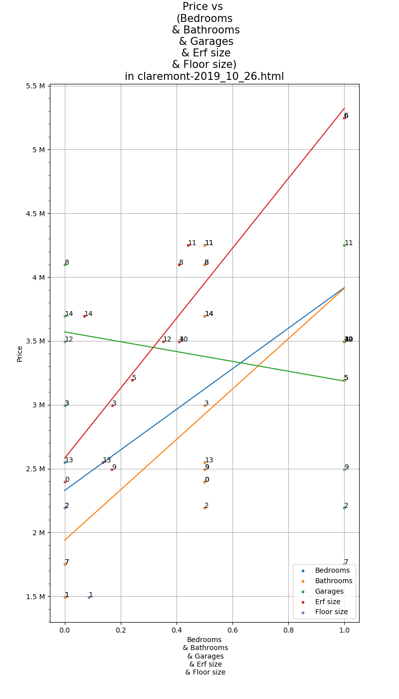
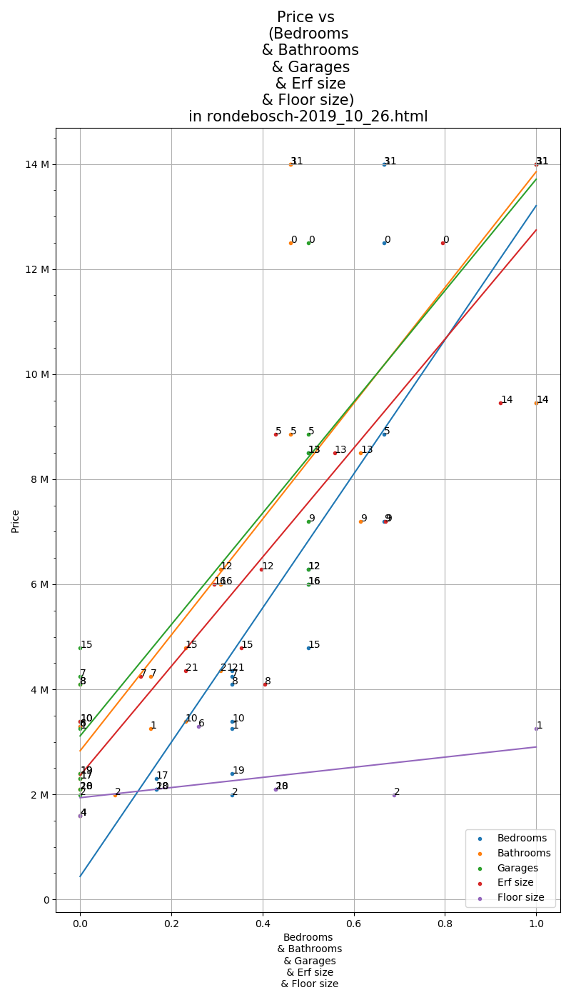
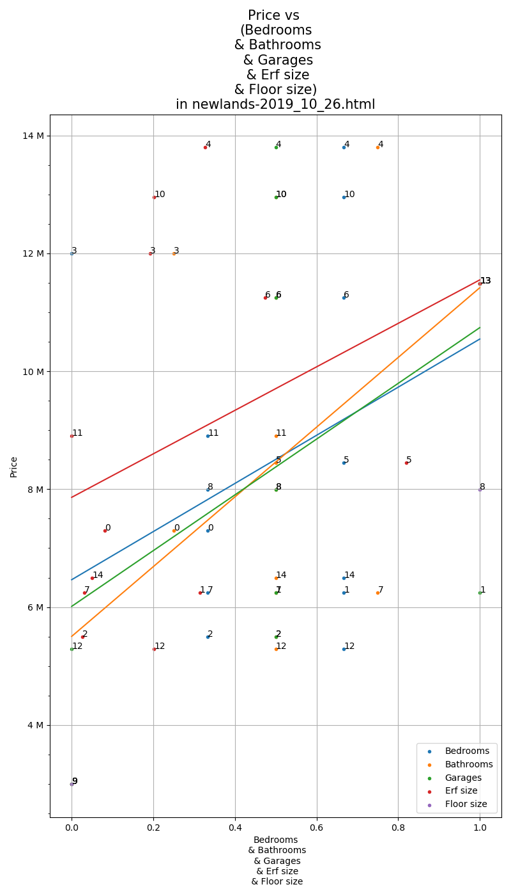

# Purchase Analysis

PurchaseAnalysis scrapes property prices and various other data points from 
popular real estate websites, and then visualises the data in order to better 
spot outliers that are under- or over-priced.

## Output
* Currently, running `main.py` will visualise each of the `html` files found 
in `PATHS`. 
* Each `html` file will result in a graph, with property price on
the y-axis and multiple values on the x-axis, as determined by `x-keys`:
```python
x_keys = [
        "bedrooms",
        "bathrooms",
        "garages",
        "erf size",
        "floor size"
    ]
```
* Note that feature scaling is performed such that every x-value is scaled 
to be between 0 and 1, with 0 being the minimum value and 1 the maximum. 
This is not ideal in many regards, but allows for easy comparison between 
square meterage, number of bedrooms, etc.


## Example Graphs

### Claremont Property Prices


### Rondebosch Property Prices


### Newlands Property Prices


## Future Features to Add
* Automatically navigate to the following pages of search results and add it all as one dataset
* Make the graphs more intuitive to get an understanding of
* Add qualifiers to the linear regression lines to indicate their goodness-of-fit
* Add ability to see trends in a suburb over time
* increase granularity in search parameters: add ability to graph search results based 
off of different parameters

## File Structure
```
.
|-- README.md
|-- _data
|   |-- claremont-2019_10_26.html
|   |-- mowbray-2019_10_26.html
|   |-- newlands-2019_10_26.html
|   |-- rondebosch-2019_10_26.html
|   `-- rondebosch-2019_11_17.html
|-- graphs
|   |-- claremont-2019_10_26.txt
|   |-- mowbray-2019_10_26.txt
|   |-- newlands-2019_10_26.txt
|   |-- rondebosch-2019_10_26.txt
|   |-- rondebosch-2019_11_17.png
|   `-- rondebosch-2019_11_17.txt
|-- main.py
`-- readme_resources
    |-- claremont-2019_10_26.png
    |-- newlands-2019_10_26.png
    `-- rondebosch-2019_10_26.png
```