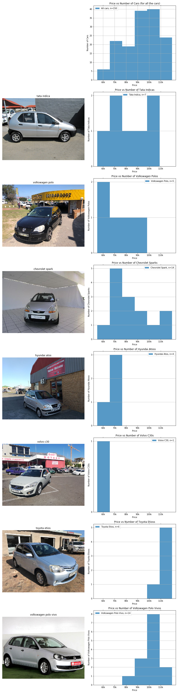

# Purchase Analysis

Last Updated: 07 December 2019

PurchaseAnalysis is a general-purpose web scraper 
and visualiser for analysing prices. Currently this 
is applied to housing prices and the second-hand car market


## Usage

* Analysis of different items (eg cars, houses, apartments, etc) 
are stored separately, under `project_files/`
* Each directory in `project_files/` is for 
web-scraping scripts and the csv files for that item-type
* Once the data is collected, scripts in the project root 
directory are used to actually do the analysis and visualisations
* Currently only `project_files/cars` is in development
* In `project_files/cars`, there are the following: 
    * `graphs/` - directory for storing all graphs/visualisations 
    made
    * `car_links.txt` - a list of all the relevant car links (for 
    debugging purposes)
    * `cars.csv` - the details of every car collected
    * `details.md` - the specifications of what data to collect 
    about the cars
    * `scrape_cars.py` - the script that actually collects and 
    parses the data, saving it to `cars.csv`
    
* Also important is `update_cars_csv.sh`, which is 
run on a raspberry pi at regular intervals in order
to collect time series data and save it to the git repo


## Example Graphs

### Histogram of cars with & without bluetooth from cars.co.za


### Price histograms of select models from cars.co.za 


### Year, Fuel economy, and acceleration of 500 cars from cars.co.za


### Rondebosch Property Prices


## Current Features

* Automatically navigates to the following pages of search results and add it all as one dataset
* r-squared values for the linear regression lines to indicate their goodness-of-fit


## File Structure
```
PurchaseAnalysis % tree
.
|-- CSVs
|   |-- 2019_11_19
|   |   `-- ...
|   `-- 2019_11_21
|       `-- ...
|-- README.md
|-- Scratchpad.ipynb
|-- Untitled.ipynb
|-- car_links.txt
|-- cars.csv
|-- graphs
|   |-- 2019_11_19
|   |   `-- ...
|   `-- 2019_11_21
|       |-- ...
|-- main.py
|-- project_files
|   |-- apartments
|   |   `-- details.md
|   |-- cars
|   |   |-- car_links.txt
|   |   |-- cars.csv
|   |   |-- details.md
|   |   |-- graphs
|   |   `-- scrape_cars.py
|   |-- houses
|   |   |-- details.md
|   |   `-- scrape_houses.py
|   `-- template
|       |-- details.md
|       |-- graphs
|       `-- template.csv
|-- readme_resources
|   |-- bt_hist.png
|   |-- cars_co_za.png
|   |-- green_point.png
|   |-- models_vs_price.png
|   |-- models_vs_price_full.png
|   |-- models_vs_price_pruned.png
|   |-- models_vs_price_pruned_cropped.png
|   |-- rondebosch.png
|   |-- sea_point.png
|   `-- woodstock.png
|-- requirements.txt
|-- update_cars_csv.sh
`-- visualise_data.py

```
