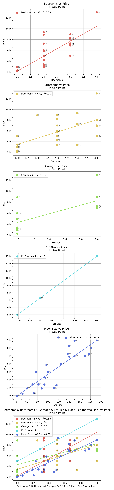
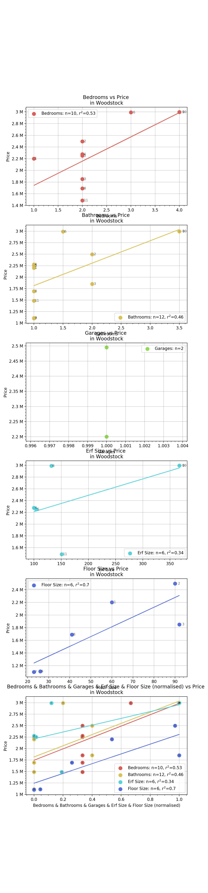

# Purchase Analysis

Last Updated: 20 November 2019

PurchaseAnalysis scrapes property prices and various other data points from 
popular real estate websites, and then visualises the data in order to better 
spot outliers that are under- or over-priced.

## Output
* Currently, running `main.py` will visualise each of the `html` files found 
in `PATHS`. 
* Each `html` file will result in a graph, with property price on
the y-axis and multiple values on the x-axis, as determined by `x-keys`:
```python
x_keys = [
        "bedrooms",
        "bathrooms",
        "garages",
        "erf size",
        "floor size"
    ]
```
* Note that feature scaling is performed such that every x-value is scaled 
to be between 0 and 1, with 0 being the minimum value and 1 the maximum. 
This is not ideal in many regards, but allows for easy comparison between 
square meterage, number of bedrooms, etc.


## Example Graphs

### Newlands Property Prices


### Green Point Property Prices


### Rondebosch Property Prices


### Sea Point Property Prices


### Woodstock Property Prices



## Current Features
* Automatically navigates to the following pages of search results and add it all as one dataset
* r-squared values for the linear regression lines to indicate their goodness-of-fit

## Future Features to Add

* Make the graphs more intuitive to get an understanding of
* Add ability to see trends in a suburb over time
* increase granularity in search parameters: add ability to graph search results based 
off of different parameters

## File Structure
```
PurchaseAnalysis % tree -L 2

.
├── CSVs
│   └── 2019_11_19
├── README.md
├── _data
│   └── 2019_11_19
├── graphs
│   └── 2019_11_19
├── main.py
├── readme_resources
│   ├── green_point.png
│   ├── newlands.png
│   ├── rondebosch.png
│   ├── sea_point.png
│   └── woodstock.png
└── requirements.txt
```
