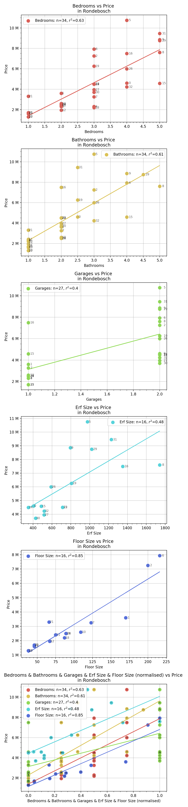

# Purchase Analysis

Last Updated: 2020-01-01

PurchaseAnalysis is a general-purpose web scraper 
and visualiser for analysing prices. Currently this 
is applied to housing prices and the second-hand car market

## Usage

### Populating the database
* Running the script `update_cars_db.sh` will:
  * Pull any changes from the github repo
  * Run `project_files/cars/scrape_cars.py` which collects the 
  most up-to-date information about the cars from various websites
  and stores various data about them in `project_files/cars/items.db` 
  and the links to those cars in `project_files/cars/car_links.txt`
  * Push these changes to github in a commit named `Beep Boop: Automatic update from raspberry pi`
* `update_cars_db.sh` is intended to be run from `crontab` automatically
and is set up on a raspberry pi to run every night
* Note that `PurchaseAnalysis/main.py` is deprecated and not in use at all.

### Analysis of the data
* Data analysis isn't automated at the moment, however there are
various cells in `Scratchpad.ipynb` which are usefull for quick graphs of
the data

## Selected Features
* Scrape and parse 20+ variables (engine size, price, number of doors, etc)
from cars.co.za
* Automatically scrape and store the car data every night
* Store the changes in price per vehicle over time

## Example Graphs

### Histogram of cars with & without bluetooth from cars.co.za

### Year, Fuel economy, and acceleration of 500 cars from cars.co.za

### Rondebosch Property Prices

# TODO
* Expand to Property24
* remove the silly git update thing
* Fix user-agent errors
* remember to remove items from the db if they're out of date

## Property24 values:
Note that no assumptions can be made wrt the type of input. Estate agents can put whatever they want into most of the fields

* Method: for sale, to rent, (on auction?, for retirement?)
* type: house, flat, townhouse, vacant land, farm, commercial, industrial
* Bedrooms
* Bathrooms
* Kitchens
* Lounges
* Dining Rooms
* Office
* Parking
* Domestic Rooms
* Garages
* Gardens
* Pools
* Occupation date
* lease period
* street address
* floor number
* Nearby Public Transport
* Internet Access
* erf size
* floor size
* 'Outbuilding:' (Granny Flat)
* 'Security': (1)
* Flatlet: Yes
* Furnished?
* Pet friendly/Pets allowed
* Rates and taxes
* Other amenities
* Description?
* Listing date
* POI_ID -> linked to a POI table, which describes all it's POIs:
    * POI_ID
    * point_name
    * point_category
    * point_distance
* Province
* Town
* Suburb
* ID
* photo links
* item link
* Address (if given)
